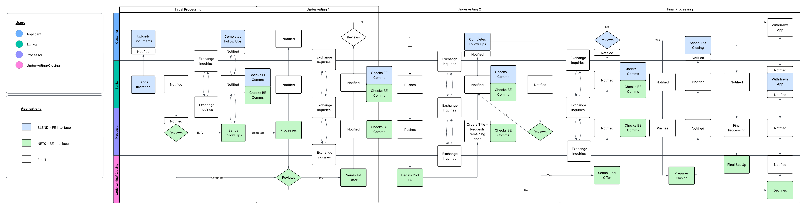
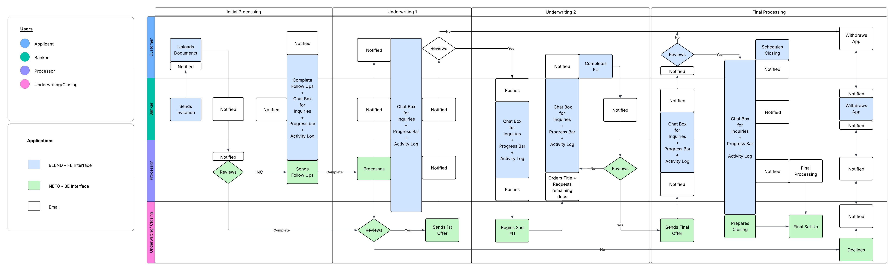
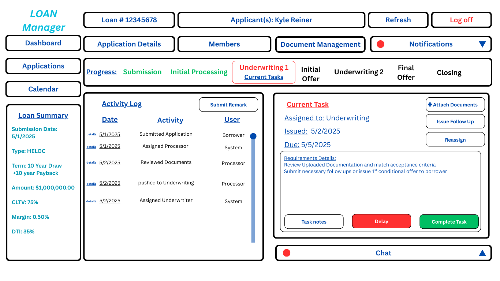

# HELOC Process Improvement Case Study

## Project Overview
This project focuses on redesigning the Home Equity Line of Credit (HELOC) application tracking experience for bankers at our financial institution. The goal is to streamline the tracking process, close critical skill gaps, and enable bankers to deliver faster, more accurate service through a fully redesigned UX/UI platform.

## Problem Statement
- The current banker-facing HELOC platform is fragmented and difficult to use.
- Bankers must switch between multiple apps and screens to:
  - See current file handler (processor, underwriter, closer)
  - Read comments/notes (in another section)
  - Check applicant follow-up tasks (in a different app)
  - Monitor application deadlines via periodic email reminders
- Lack of consolidated visibility leads to:
  - Poor user experience (UX)
  - Process confusion and errors
  - Skill gaps for bankers unfamiliar with back-end process flow

## Goal
To develop a new **live tracker app** that:
- Provides a **full lifecycle visual map** of the application.
- Highlights the **current stage** in real time.
- Clearly lists **pending tasks** with deadlines.
- Displays **upcoming stages** and related stakeholder actions.
- Reduces reliance on fragmented apps, notes, and email reminders.

## Approach
1. **Needs Identification**: Gather insights from frontline bankers, processors, and underwriters.
2. **Requirements Gathering**: Define what bankers need to see, trigger, and track within one platform.
3. **Process Mapping**: Map the "As-is" (current) process and "To-be" (optimized) application lifecycle.
4. **Solution Evaluation**: Design UX/UI wireframes for the new app; evaluate integration options with back-end processing systems.
5. **Validation & Testing**: Build UAT scripts; test usability with a pilot group of bankers.
6. **Implementation Support**: Create training materials and rollout plans.
7. **Monitoring & Optimization**: Capture banker feedback and usage analytics post-launch.

## Success Criteria
- 80%+ banker satisfaction score on new platform usability.
- 50% reduction in application status-related errors.
- 30% improvement in banker response times to applicant needs.

## Artifacts
- Requirements documentation (BRD, user stories)
- [Wireframe-integrated process flow diagram mockups](process-mapping)
- [Sample dashboard design](dashboards-concepts/heloc-tracker-dashboard.png)
- [User Acceptance Testing Plan](uat-test-plan/UAT-HELOC-Live-Tracker.md)
- [Monitoring KPIs and feedback collection strategy](change-management/Monitoring-KPIs-HELOC-Live-Tracker.md)

---

# Business Requirements Document (BRD)

## Project: HELOC Banker Live Tracker Platform

### Objective
Build a centralized and intuitive application that:
- Consolidates application status, stakeholder roles, applicant action items, and deadlines into a live progress map.
- Enables bankers to easily understand, track, and trigger client and processor actions without switching between multiple systems.

### Functional Requirements
- Display real-time status of HELOC application lifecycle.
- Highlight current application stage with visual indicators.
- Show pending applicant tasks, processor actions, and underwriter reviews.
- Allow bankers to send automated reminders to applicants for document uploads and responses.
- Provide upcoming stage previews.
- Centralize communications, notes, and document requests in one location.

### Non-Functional Requirements
- Responsive and mobile-friendly UI.
- Secure access control integrated with bank SSO systems.
- Fast load times (under 3 seconds for any page).
- Minimal training required (platform should be self-explanatory).

### User Roles
- Banker (primary user)
- Processor (backend stage advancement)
- Applicant (external interaction via upload/request portal)
- Underwriter/Closer (review and finalize)

### Business Rules
- Front end application should be able to automatically trigger to next stage by the user the current stage is tasked to.
- All users can send document requests, view notes, and communicate progress.
- Deadlines for applicant responses should trigger escalation notifications according to application process manual.

### Success Metrics
- Banker understanding of HELOC lifecycle stages improves by 70% (survey-based).
- 50% fewer banker escalations to support desk for "application status" issues.
- Application abandonment rate by applicants reduces by 25%.

### Assumptions
- Current backend application management system remains the same; new platform serves as banker-facing overlay.
- No direct API access for processors or underwriters.

### Risks
- Data synchronization lags between backend system and new UI.
- User adoption risks if training or interface is not intuitive enough.

## Process Models
### Current
- Multiple platforms for communication, status updates, executuon.
- Creates redundency, flip flopping, and longer processing times.

### Future
- Reduces redundency by maximizing FU platform.
- Improves efficiency and communication.

## Sample Dashboard Design

## 📋 User Acceptance Testing (UAT) Plan

The UAT plan outlines key testing scenarios to validate the HELOC Live Tracker functionality, including application status tracking, pending task visibility, reminder triggers, and escalation flows.

➡️ [View Full UAT Test Plan](uat-test-plan/UAT-HELOC-Live-Tracker.md)

## 📈 Monitoring and Continuous Improvement

The Monitoring and Optimization Plan tracks KPIs such as banker satisfaction, application processing times, and escalation incidents to ensure the HELOC Live Tracker delivers continuous value.

➡️ [View Full Monitoring and KPI Plan](change-management/Monitoring-KPIs-HELOC-Live-Tracker.md)
